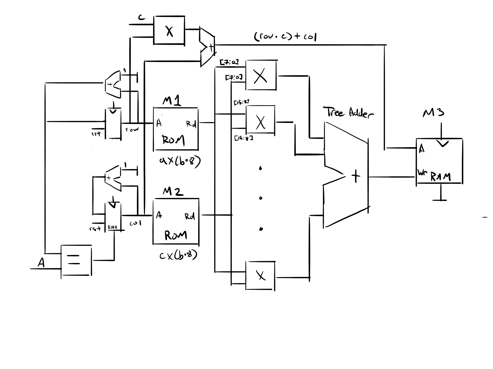
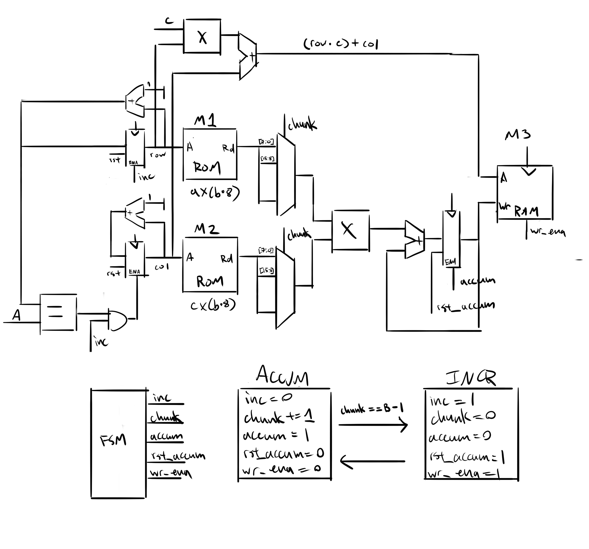

# Int 8 Matrix Multiplication

## Overview

This project implements a single matrix multiplication in simulation, with the
inputs read from two ROMS and the output written to a single RAM.

The inspiration for this project came from [Neural Cellular
Automata](https://distill.pub/2020/growing-ca/) (NCA), a variation of cellular
automata (like Conway's Game of Life) but parametrized with a neural network.
Cellular automata are nice in that they are extremely easy to parallelize - each
cell's new value can be computed almost entirely in isolation, with only a quick
look at its neighbors at the start of an update. As a result, they work well for
hardware, where it is easy to design a single specialized component that is then
repeated across a board.

To actually implement this single cell update, we would need to be able to run
the neural network that updates a cell, which in turn would require an
implementation of a matrix multiplication. Further, when running something as
heavy as a NN on an edge device, [network
quantization](https://arxiv.org/pdf/1712.05877.pdf) is recommended. Quantization
is the process in which we reduce the size of the network parameters, usually
from 32 or 64 bit floats to integers. This means that we can build our hardware
using integers.

So, this project aims to implement the smallest building block towards running a
NCA - a single, uint8 matrix multiplication. To steps to go from this project to
a single cell NCA update are:
1. Add all quantization operations ([See paper, section
   2.3](https://arxiv.org/pdf/1712.05877.pdf))
    1. Compute cached sum of matrix rows and columns
    2. Implement bias term
    3. Implement fixed point division and shift scaling operation
2. Implement chaining multiple matrix multiplications together
    1. Read from a flat RAM (a \* b x 8) instead of block ROM (a x b \* 8)
    2. FSM to iterate over each sequential matrix multiplication
3. Implement loading a model
    1. Quantize a NCA model
    2. Export NCA model to FPGA readable format
    3. Load NCA model

## Modules

### In / Out

Both modules assume the same input and output structure. Inputs are two ROMs,
each with a uint8 matrix loaded in them. Assume the first matrix has size A x B,
and the second has size B x C. The first ROM is assumed to be of size A x (B \*
8), where each row of the ROM represents a packed row of the matrix. Similarly,
the second ROM is assumed to be of size C x (B \* 8), where each row of the ROM
represents a packed column of the matrix. Finally, the output is a RAM of size
(A \* C) x 32 - a flat representation of the output matrix, with 32 bit integer
elements. A `valid` signal is also set to 1 when the calculation has completed.

(NOTE: ROMs are also assumed to be combinatorial!)

The modules should be passed the ROM address and data wires, and the RAM write
address, write data and write enable wires.

### matmul

matmul is the MVP for this project. As it computes the entire inner dot product
of the matrix multiplication in a single cycle, it is relatively limited in
scope. This is due to two factors:
- The number of slices on the FPGA is limited. If the B dimension is too large,
  the dot product cannot be computed in a single cycle and this module will
  fail.
- The dot product operation requires summing the product of the element wise
  multiplication of two vectors. The implementation of this summation in this
  module is hardcoded, and therefore B is limited to a value of 32.

The above diagram shows the general structure of the module.
- The first component is a set of two registers that track the current row and
  column we are multiplying. We iterate over all rows (until `row + 1 == A`)
  before moving to the next column. Not included in the diagram - the `valid`
  signal is set when both row and col reach their end values. When `valid` is
  set, the registers stop incrementing.
- The second component is the calculation of the dot product. This is computed
  as several parallel multiplications, followed by a tree of adders to produce
  the final value.
- The third component is the RAM. The write address is calculated as `(row * C) +
  col`, and the write enable is always on (since we write every cycle). The
  final value of the dot product is set to the write data.

### matmul_n

matmul_n is the improvement on matmul. It takes B cycles to compute the dot
product, multiplying each element of the vectors at a time and accumulating the
results in a register. This enables it to multiply two matrices of arbitrary
size, assuming they and the result fit in memory.

The above diagram shows the general structure of the module. matmul_n is similar
in structure to matmul, but uses uses a FSM with two states, `ACCUM` and `INCR`,
to module when operation occur.
- When in `ACCUM`, several things happen:
  - `inc` is set to 0, freezing row and col
  - `chunk` is incremented, selecting a new set of elements
  - `accum` is set, allowing us to add the product of the two elements as selected by
    `chunk` to the accumulation register.
  - The state changes back to `INCR` when `chunk == B - 1` and we've computed the dot
    product
- When in `INCR`, several things happen:
  - `inc` is set, allowing the rows and columns to increment.
  - `wr_ena` is set, writing the computed dot product to the RAM.
  - `rst_accum` is set, to reset the accumulation register for the next
    operation
  - The state changes back to `ACCUM` on the first clock cycle.

Note, the verilog implementation of the module does not match the diagram
exactly. Aside from the addition of `valid`, the handling of the accumulation
register is part of the FSM, similar to the handling of `chunk` in the diagram.
This means there is no `accum` or `rst_accum` wire as shown in the diagram.

The matmul_n module can also be extended to be more efficient. Currently, it
computes only a single multiplication each clock cycle, and therefore does not
utilize all available slices. A better approach might be to combine matmul and
matmul_n's approaches, computing the dot product of chunks of the vectors.

## Testing

To test the modules, we first use a python script (`generate_memories.py`) to
generate random input matrices and the correct output matrix. The values are
dumped as hex at `memories/*.memh`, then are loaded in the testing module. The
testing module loads the input matrices into the ROMs, and initializes the RAM
with 0s. Then, the clock is ran until `valid` is set by the module, at which
point we compare the computed values with the validation values computed by
Numpy.

To run testing use either `make test_matmul` or `make test_matmul_n`. The A, B
and C parameters can be configured in the makefile, but note that matmul will
break if B != 32.

